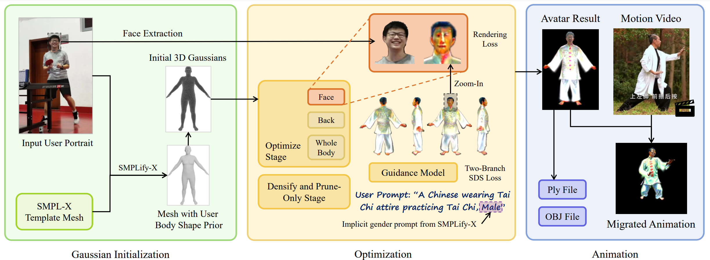

# AAGaussian: Animable Avatar Generator with Portrait and Effect Prompt

## Team Work of SJTU CS3310, 2023 Fall

### [Report](https://github.com/UNIkeEN/AAGaussian/blob/main/report.pdf)

---

We proposes an efficient **AAGaussian** framework based on the emerging 3D Gaussian scene representation, designed to create virtual human avatars with intricate structures and realistic appearances. This framework also includes an animation generator that can add smooth animations to the generated virtual figures based on motion video input.

## Acknowledgements

This work was conducted as a group assignment for the course CS3310 Computer Graphics at Shanghai Jiao Tong University. The computations in this work were run on the $\pi$ 2.0 cluster supported by the Center for High Performance Computing at Shanghai Jiao Tong University. 

Special thanks are also extended to Zhiye Wang for his contributions in the testing data capture and animation processing scripts.